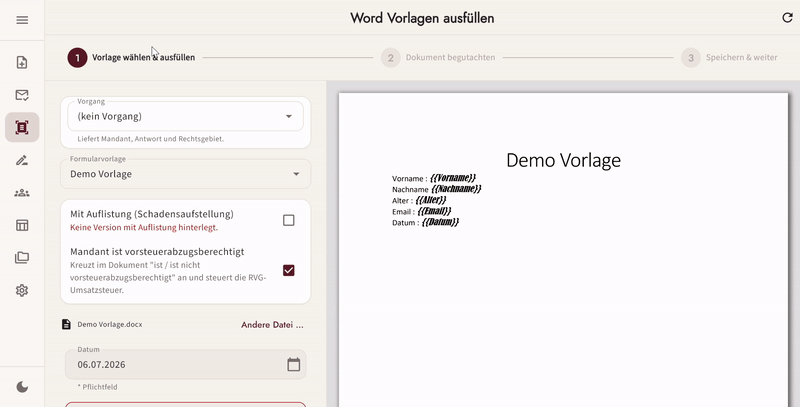
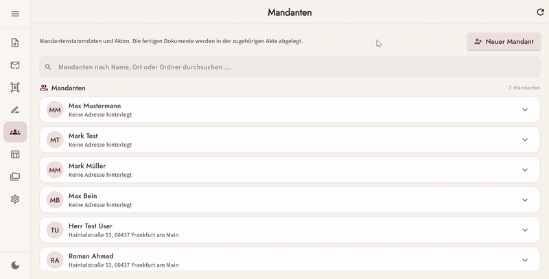
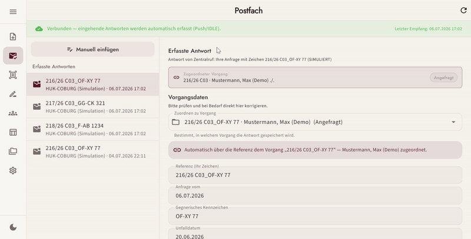
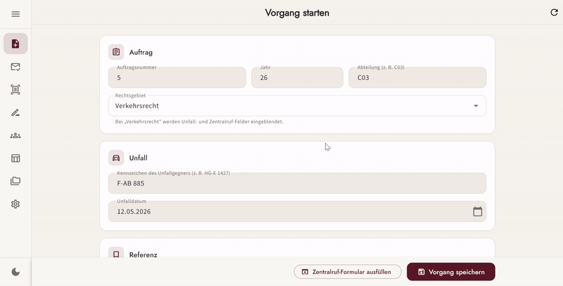
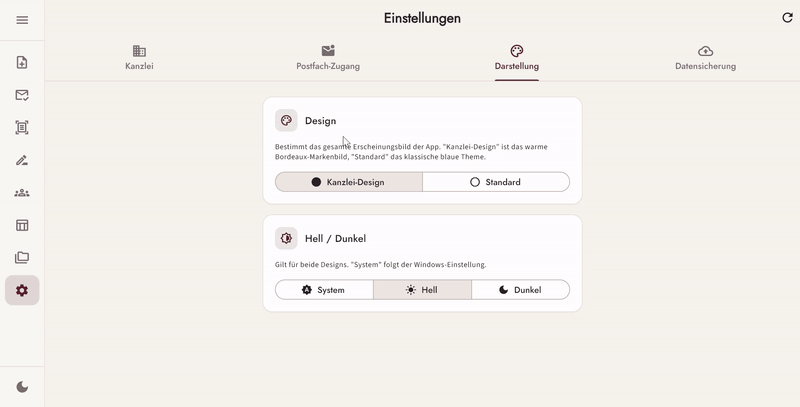
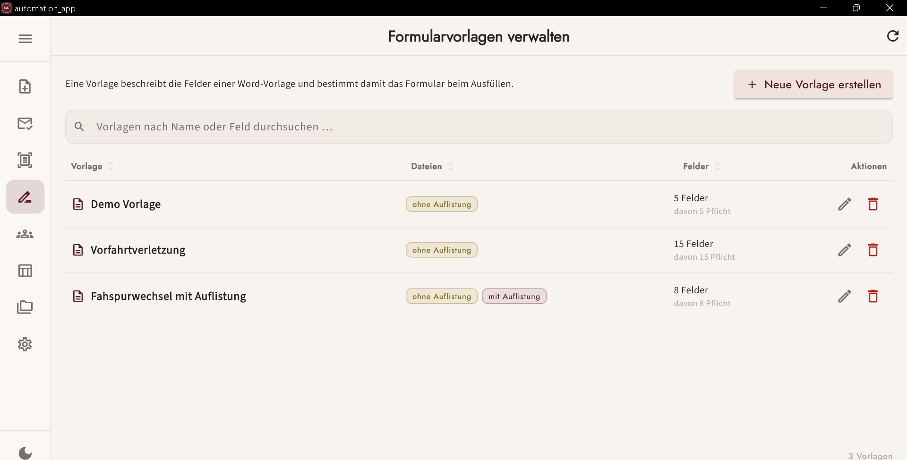
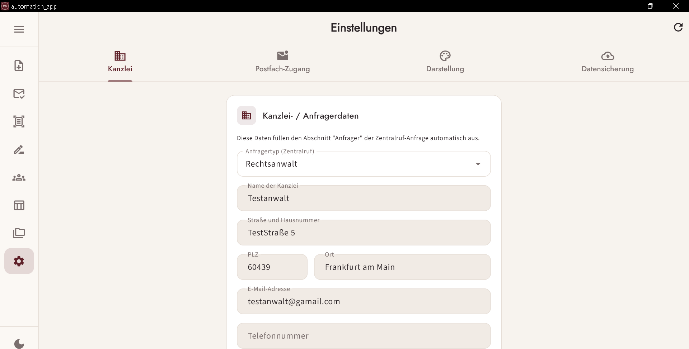

# Office Automation App

[](https://github.com/Romanahmad32/Automation_App/actions/workflows/ci.yml)

A **Flutter desktop app with an ASP.NET Core backend** that automates repetitive
office paperwork in a law-firm workflow: querying the German insurance registry
(Zentralruf) for the opposing insurer, filling Word claim letters including the
statutory attorney-fee calculation, and monitoring a mailbox for incoming
replies — so routine documents are generated in seconds instead of minutes.

Frontend and backend live in this one repository: the Flutter entity and the C#
DTO are connected only through string keys, so a contract change has to be
reviewable as **one** commit and **one** diff.



## Demo

| | |
|---|---|
| **Client management (Mandanten)** — search, create and edit client records with their case files |  |
| **Mailbox monitoring** — incoming replies are captured live (IMAP push) and their data is extracted into structured fields |  |
| **Zentralruf autofill** — start a case, and the insurance inquiry form in the browser is prefilled automatically |  |
| **Theming** — light/dark mode with persisted preferences |  |

**Template management** — reusable Word templates with their detected placeholder fields:



**Settings** — firm data used to prefill the Zentralruf request form:



*All names, addresses and case numbers shown are test/dummy data.*

## Features

- **Case as the backbone (`Vorgang`)** – links client, reference number, insurer
  reply and generated document, and carries a lifecycle status from *requested*
  through *filed* to *sent*
- **Word automation wizard** – detects `{{placeholders}}` in Word templates,
  fills them from structured form data, builds the damage-listing table and
  computes the statutory attorney fee (§ 13 RVG)
- **PDF preview** – documents are converted server-side and reviewed in-app
  before they are filed
- **Zentralruf request & reply** – prefills the insurer inquiry form in a real
  browser (the captcha deliberately stays with the lawyer) and parses the reply
  mail back into structured fields
- **Mailbox monitoring** – event-based IMAP IDLE watch pushed to the UI over
  SignalR; supports Gmail app passwords and Microsoft OAuth for Outlook/M365
- **Client register & insurer knowledge base** – client records with
  file-system case folders; insurer contact data is learned from every reply and
  fills gaps in later ones
- **Intelligent data reuse** – data entered once is offered as prefill later,
  with its source shown per field; conflicting values surface as an explicit
  keep/overwrite choice instead of being dropped silently
- **Backup & restore** – one-click backup of the embedded database

## Architecture

```
Automation_App/
├── AutomationService/          ASP.NET Core backend (net10.0), port 5143
├── Automation_App_Frontend/    Flutter desktop frontend (target: Windows)
├── Beispiele/                  Anonymised sample data
├── docs/                       Setup guides and demo media
└── tools/                      Standalone .NET helper programs
```

**Backend — vertical slices.** Each feature lives under `Features/<Name>/`,
split into `Domain` (logic, persistence config) and `Presentation`
(controllers, DTOs, DI wiring). Wiring happens through `Add<Feature>Services`
extension methods. Persistence is EF Core on an embedded SQLite database owned
solely by the backend. It does the work Flutter cannot: Word document
manipulation (DocX + Word COM interop), browser automation (Playwright) and
IMAP.

**Frontend — Clean Architecture per feature.** Each feature under
`lib/features/` is split into `data` → `domain` ← `presentation`.

- **State management:** BLoC / Cubit (`flutter_bloc`)
- **Dependency injection:** `get_it` + `injectable` (code-generated)
- **Navigation:** `auto_route`
- **Forms:** `reactive_forms`
- **Networking:** `dio` (REST) + SignalR client for live updates
- **Models:** `freezed` + `json_serializable`

The frontend holds no local persistence — every store goes through the backend
over HTTP.

Both layer rulesets are enforced as **executable architecture tests** rather
than prose, so a violation fails the build instead of a review.

## Getting started

```powershell
# Backend — http://localhost:5143
cd AutomationService/AutomationService
dotnet run

# Frontend
cd Automation_App_Frontend
flutter pub get
dart run build_runner build --delete-conflicting-outputs
flutter run -d windows
```

Files ending in `.g.dart`, `.freezed.dart`, `.gr.dart` and
`injection.config.dart` are generated — never edit them by hand, run
build_runner instead.

Start the backend **before** the frontend: a debug build has no bundled service
next to it, so the app shows a start-error screen (with a retry button) instead
of the UI.

## Releasing

```powershell
git tag v1.0.0 && git push origin v1.0.0
```

Builds a per-user Windows installer and attaches it to a GitHub release. The tag
is the single source of the version number. See [docs/RELEASE.md](docs/RELEASE.md)
for the shipped layout, where user data lives, and how updates behave.

## Tests

```powershell
cd AutomationService/AutomationService && dotnet test AutomationService.Tests
cd Automation_App_Frontend && flutter test && flutter analyze
```

Tests cover the business logic — fee calculation, placeholder matching, reply
parsing, persistence — plus the architecture rules described above.

## History

This repository was previously named `flutter_automation_app`. Backend and
frontend used to be separate repositories; the backend was merged in as a
subtree. Both histories are fully preserved:

```bash
git log -- AutomationService/                                # backend line
git log --follow -- Automation_App_Frontend/lib/main.dart    # frontend line
```

## Data protection

No real client data belongs in this repository (GDPR, § 203 StGB — German
attorney confidentiality). `Beispiele/Anwortemail von Zentralruf.txt` is an
**anonymised** version of a real reply: registration number, policy number and
firm block are replaced with placeholders while structure and formatting are
kept, so the parser is still tested realistically. Generated letters
(`Generated/`), the SQLite database and case folders are excluded via
`.gitignore`. The requirements document and the agent instructions describe
internal firm procedures and are kept out of this public repository as well.
